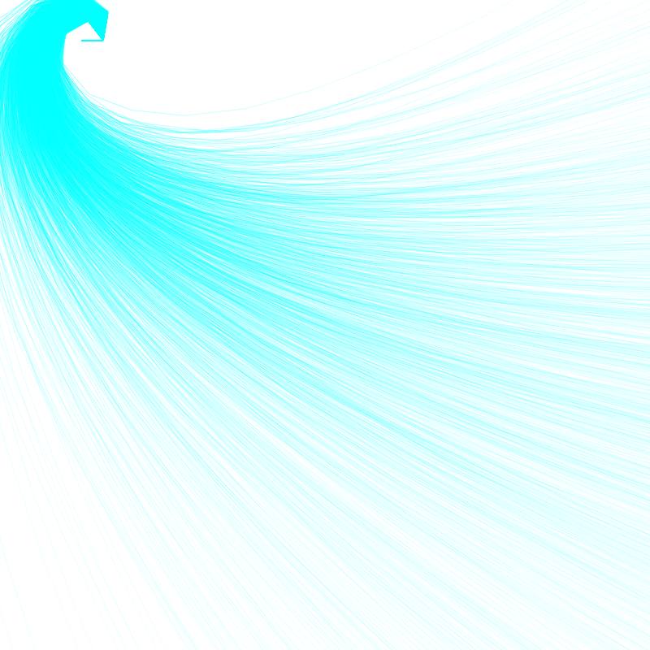

## Generative alogorithms

### Resources
- http://inconvergent.net/
- http://n-e-r-v-o-u-s.com/

### Tree
See an [animated version](https://rawgit.com/deanturpin/Generative/master/tree.html).

### Spirograph

### Feather

### Sambucus (elderberry)

### Seaweed

