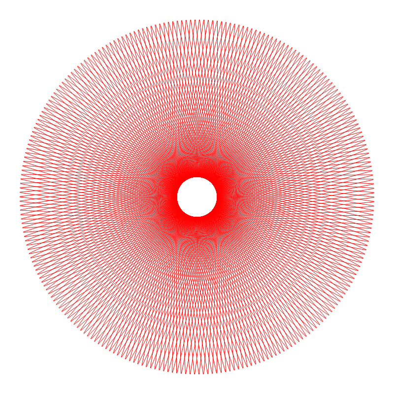

## Generative alogorithms

### Resources
- http://inconvergent.net/
- http://n-e-r-v-o-u-s.com/

### Record


### Tree
See an [animated version](https://rawgit.com/deanturpin/Generative/master/tree.html).


### Tree 2
Central branch is longer than the left and right.


### Times tables
Inspired by [Mathologer](https://t.co/bIaBHG5UqA).




### Sambucus (elderberry)


### Tail


### Arabic


### Grid


### Seaweed


### Hair


### Oculus


### Vein 2


### Fern


### Spirograph


### Crystal


## Rendering GIFs
Capture desktop
```bash
recordmydesktop -x 1700 -y 230 --width 1450 --height 1500
```

Resize and render to animated GIF 
```bash
ffmpeg -ss 2 -i out-15.ogv -r 24 cardio3.gif
ffmpeg -i cardio3.gif -vf scale=320:-1 cardio3_smaller.gif
```

ffmpeg -ss 2 -i -r 24 cardio3.gif

ffmpeg -i cardio3.gif -vf scale=320:-1 cardio3_smaller.gif
