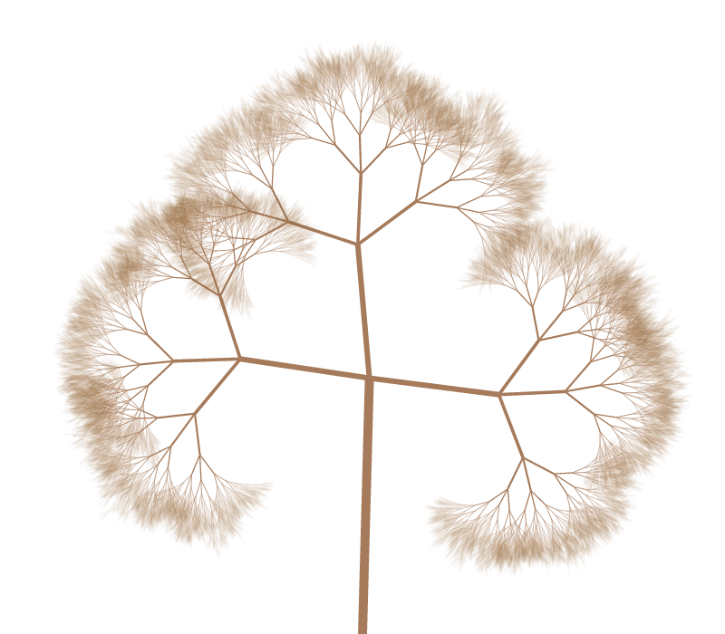

## Generative alogorithms

### Resources
- http://inconvergent.net/
- http://n-e-r-v-o-u-s.com/

### Tree
See an [animated version](https://rawgit.com/deanturpin/Generative/master/tree.html).

### Sambucus (elderberry)

### Tail

### Arabic

### Grid

### Seaweed

### Hair

### Oculus

### Vein 2

### Fern

### Spirograph

### Arc

